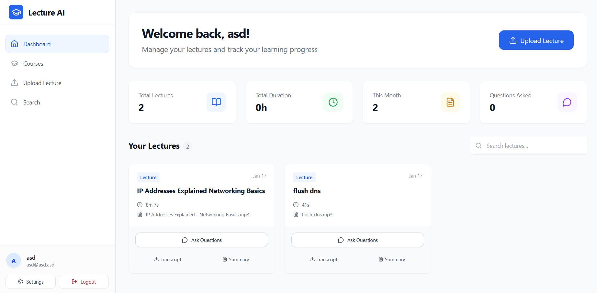
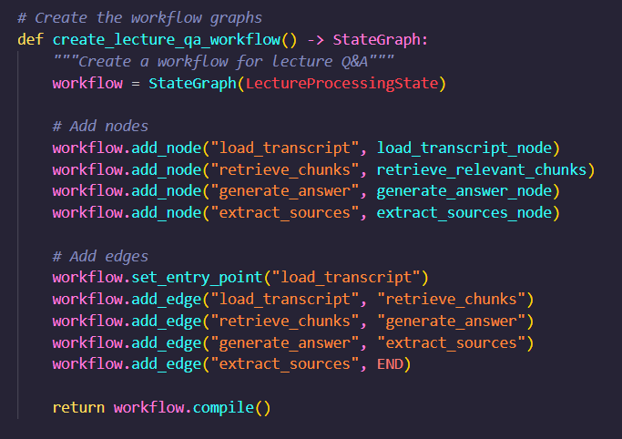

## HOW TO START THE PROJECT?
The project is already described in `docker-compose.yml`, so the easiest way to start it is to use Docker as the project contains 7 different containers (services).
I recomment using Docker, if you do not have it yet, download it from here: [Download Docker](https://www.docker.com/get-started/)

After installing Docker follow these steps:
- Open terminal in the project's root directory
- Run `docker compose up --build` command in the terminal
- Wait until you see the backend message `uvicorn server running on ...` 

**IMPORTANT**
After the backend has started, you can view the app, but you will not be able to use the AI models. That is because the Ollama models need to be pulled first, so follow these steps:
- Run `docker ps` command
- Find the `lecture-scraper-backend` container and copy its ID
- Now run `docker exec -it {This is the container ID} ollama pull llama3.2:3b
- After it fineshes, install the next model by running:
``` docker exec -it {This is the container ID} ollama pull  nomic-embed-text ```

Now the app will be running correctly.

*NOTE: If something is not working, it may be due to several reasons:*
1. The models require GPU and CUDA, but you do not have them.
2. Size limitation - the app and models may require more space than you have
3. Ports not being exposed correctly.

*So keep that in mind in case something goes wrong.*


# Specification (Task 1)

---

# Tutor AI: Generative AI Application Specification: Personal Learning Assistant

## Project Overview

### Problem Description
Learners often struggle to efficiently consume and understand educational content from various sources (videos, articles, podcasts). The process of watching long videos, reading lengthy articles, and finding answers to specific questions is time-consuming and doesn't adapt to individual learning needs or questions that arise during study.

### Target Audience
- **Primary**: Self-directed learners and students seeking to understand complex topics
- **Secondary**: Professionals needing to quickly learn new skills for career development
- **Tertiary**: Curious individuals exploring new subjects and hobbies

## Main Use Cases (User Stories)

### Use Case 1: Lecture Upload and Processing
**As a learner**, I want to upload lecture recordings (audio/video) and get them processed, so that I can search and ask questions about the content later.

**User Flow:**
1. User uploads lecture file (video, audio) through drag-and-drop interface
2. System transcribes the audio using Whisper with timestamps
3. System processes transcript and creates searchable embeddings
4. User receives confirmation when processing is complete
5. Lecture appears in user's dashboard for interaction

### Use Case 2: Q&A Search Within Lectures
**As a student**, I want to ask specific questions about uploaded lectures and get accurate answers with source citations, so that I can quickly find information without re-watching entire recordings.

**User Flow:**
1. User selects a lecture from their dashboard
2. User types a question about the lecture content
3. System uses RAG to find relevant transcript segments
4. System generates answer with timestamp citations
5. User can click timestamps to jump to specific moments in lecture

### Use Case 3: Course Organization
**As a learner**, I want to organize multiple lectures into courses for better structure, so that I can group related content and navigate between lectures efficiently.

**User Flow:**
1. User creates a course with name and description
2. User adds existing lectures to the course
3. User can view all lectures within a course
4. User can navigate to individual lecture pages for Q&A
5. User can manage course membership (add/remove lectures)

## System Architecture

### Inputs
- **File Upload**: Audio/video files (MP4, MP3, WAV, M4A) for lecture recordings
- **Text Input**: Questions about lecture content
- **Course Management**: Lecture organization into courses
- **User Authentication**: Login/registration for data isolation

### Outputs
- **Transcriptions**: Time-stamped text transcripts of uploaded lectures
- **Q&A Responses**: Answers to questions with source citations and timestamps
- **Search Results**: Relevant transcript segments for user queries
- **PDF Exports**: Downloadable transcripts and summaries
- **Course Organization**: Structured grouping of related lectures

## System Parameters

### Transcription Controls
- **Audio Quality**: Auto-detect, High quality, Standard quality
- **Language**: Auto-detect, English, Spanish, French, German, etc.
- **Timestamp Precision**: Every 30 seconds, Every minute, Every 5 minutes
- **Processing Speed**: Real-time, Standard, High quality (slower)

### Search and Q&A Controls
- **Search Scope**: Current lecture only
- **Answer Detail**: Brief answer, Detailed explanation, Comprehensive response
- **Source Citations**: Show timestamps, Hide timestamps, Show transcript snippets
- **Result Count**: 3 results, 5 results, 10 results per query

### Course Organization
- **Lecture Grouping**: By subject, By date, By instructor, Custom
- **Course Management**: Create courses, Add/remove lectures, Course descriptions
- **Navigation**: Quick access to lectures within courses

### Export Options
- **Format**: Transcript only, Summary only, Full transcript with timestamps
- **File Type**: PDF, TXT, DOCX
- **Content**: Questions and answers, Citations only, Complete session

### Advanced Parameters
- **LLM Model**: llama3.1:8b (faster), llama3.1:70b (more accurate)
- **Embedding Model**: nomic-embed-text (default)
- **Chunk Size**: Small chunks (more precise), Large chunks (more context)
- **Retrieval Strategy**: Semantic search, Keyword search, Hybrid approach

## Limitations and Risk Mitigation

### Quality Limitations
**Risk**: Generated content may contain factual inaccuracies or outdated information.
**Mitigation**: 
- Implement fact-checking integration with verified sources
- User review and approval workflow
- Confidence scoring for generated content
- Source citation requirements

### Hallucination Management
**Risk**: AI may generate plausible but incorrect information.
**Mitigation**:
- Confidence indicators for each content section
- "Verify with sources" prompts for critical information
- Version control and rollback capabilities
- Peer review features for collaborative environments

### Ethical Considerations
**Risk**: Potential bias in content generation or inappropriate material.
**Mitigation**:
- Content filtering and moderation systems
- Bias detection algorithms
- Cultural sensitivity checks
- Accessibility compliance (WCAG 2.1)

### Privacy and Security
**Risk**: Sensitive educational content or personal data exposure.
**Mitigation**:
- End-to-end encryption for all content
- GDPR and FERPA compliance
- Local processing options for sensitive materials
- User data anonymization and retention policies

### Intellectual Property
**Risk**: Copyright infringement in generated content.
**Mitigation**:
- Originality checks against existing materials
- Proper attribution and citation systems
- License-aware generation (Creative Commons, Public Domain)
- Clear terms of service for content ownership

## Acceptance Criteria

### Functional Requirements
1. **Lecture Upload**: Successfully upload and process audio/video files within 5 minutes
2. **Transcription Accuracy**: 95% accuracy for clear audio, 85% for challenging audio
3. **Q&A Response Time**: Generate answers within 10 seconds with source citations
4. **Course Organization**: Create courses and organize lectures efficiently
5. **PDF Export**: Generate downloadable transcripts and summaries

### Quality Metrics
1. **Answer Relevance**: 85% of answers directly address user questions
2. **Citation Accuracy**: 90% of timestamps correctly point to relevant content
3. **Search Precision**: Top 3 results contain the answer 80% of the time
4. **Transcription Quality**: Readable and accurate timestamps for navigation

### Performance Requirements
1. **Upload Processing**: Files processed within 2x the audio duration
2. **Search Response**: Query results returned within 3 seconds
3. **Concurrent Users**: Support 100 simultaneous users
4. **File Size**: Handle lectures up to 2GB and 4 hours duration

### User Experience Criteria
1. **Intuitive Upload**: New users successfully upload first lecture within 2 minutes
2. **Effective Search**: Users find needed information without re-watching lectures
3. **Mobile Compatibility**: Full functionality on mobile devices
4. **Accessibility**: WCAG 2.1 AA compliance for all interfaces

## Technical Specifications

### Core Technologies
- **Backend**: Python with FastAPI framework
- **AI Models**: Ollama Llama3.1 for Q&A, Faster-Whisper for audio transcription
- **Vector Database**: Qdrant for semantic search and embeddings
- **Database**: PostgreSQL for user data and lecture metadata
- **Frontend**: React 19 with TypeScript for responsive interface
- **Authentication**: JWT-based user authentication
- **File Processing**: FFmpeg for audio/video handling

### Integration Points
- **Ollama Integration**: Local LLM inference for privacy and control
- **Whisper Integration**: GPU-accelerated transcription service
- **Vector Store**: Semantic similarity search for Q&A responses
- **PDF Generation**: Export transcripts and summaries for offline use

### Deployment Architecture
- **Containerization**: Docker with Docker Compose for easy deployment
- **GPU Support**: CUDA-enabled containers for faster transcription
- **Local Deployment**: Self-hosted option for data privacy
- **Monitoring**: Health checks and structured logging
- **Security**: User data isolation and secure file handling

## Current Implementation Status

### Completed Features
1. **Lecture Upload System**: Drag-and-drop interface for audio/video files
2. **Transcription Service**: Whisper-based transcription with timestamps
3. **Q&A System**: RAG-powered question answering with source citations
4. **User Authentication**: JWT-based login and registration
5. **Course Management**: Organize lectures into courses with descriptions
6. **PDF Export**: Download transcripts and summaries
7. **Individual Lecture Search**: Search within specific lectures
8. **Responsive Frontend**: React-based interface with mobile support

### Technology Stack Implementation
- **Backend**: FastAPI with PostgreSQL and Qdrant
- **AI Processing**: Ollama Llama3.1 and Faster-Whisper
- **Frontend**: React 19 with TypeScript and Tailwind CSS
- **Deployment**: Docker Compose with GPU support

## Success Metrics

### User Engagement
- Daily active users: Target 100+ within 3 months
- Lecture processing rate: 500+ lectures per week
- User retention: 70% monthly retention rate
- Feature adoption: 80% of users use Q&A features

### Learning Impact
- Time savings: Average 75% reduction in finding specific information
- Search efficiency: Users find answers in 10 seconds vs 10 minutes of re-watching
- Content accessibility: Full transcript access for all uploaded materials
- Knowledge retention: Better understanding through targeted Q&A

## Additional Information

[GitHub](https://github.com/PetarWho/TutorAI)

*Description: Clean, functional interface with three main sections:*
1. *Left panel: Lecture upload and course management*
2. *Center: Q&A interface with transcript viewer and timestamp navigation*
3. *Right panel: Search results, citations, and export options*




*The full project can be found on my [GitHub](https://github.com/PetarWho/TutorAI)*


---

# Wireframe (Task 1)

---

# Tutor AI - Main Screen Wireframe Description 

## Overall Layout
**Design Style**: Functional, clean interface focused on lecture interaction and Q&A
**Color Scheme**: Professional blue (#3b82f6) with white background and gray accents
**Typography**: Inter font family for readability and clarity

## Screen Sections

### 1. Header Bar (Top)
- **Logo**: "Tutor AI" with brain/book icon
- **Navigation**: Dashboard | Upload | Courses | Settings | Logout
- **User Profile**: Avatar with user name and login status

### 2. Left Panel - Lecture Management (30% width)
**Section A: Upload Interface**
- Drag-and-drop area for audio/video files
- File upload button with format indicators (MP4, MP3, WAV, M4A)
- Recent uploads list with processing status indicators
- Upload progress bars with time estimates

**Section B: Course Organization**
- Course list with lecture counts
- "Create Course" button
- Add lecture to course dropdown
- Course list view with lecture counts

**Section C: Lecture Library**
- List of uploaded lectures with metadata
- Duration, upload date, file size
- Status indicators (Processing, Ready, Error)
- Quick actions: View, Delete, Add to Course

### 3. Center Panel - Q&A Interface (50% width)
**Tab Navigation**: Transcript | Q&A | Export

**Transcript Tab**:
- Full lecture transcript with timestamps
- Clickable timestamps for navigation
- Highlighted text segments from search results
- Scroll with time synchronization

**Q&A Tab**:
- Question input field with submit button
- Conversation history with questions and answers
- Source citations with clickable timestamps
- "Ask follow-up" suggestions

**Export Tab**:
- PDF generation options (transcript, summary)
- Download buttons for generated files
- Export history

### 4. Right Panel - Results & Actions (20% width)
**Section A: Current Answer**
- AI-generated answer display
- Source citations list with timestamps
- "Regenerate answer" button

**Section B: Quick Actions**
- Jump to timestamp button
- Export to PDF button
- Copy citation link

**Section C: Lecture Info**
- Lecture title and duration
- Upload date and processing status
- Course assignment
- File size and format

**Section D: Help & Tips**
- Question suggestions
- Search tips
- Keyboard shortcuts

## Interactive Elements

### Upload Interface
- Drag-over visual feedback
- File validation indicators
- Progress animations
- Error messages with suggestions

### Q&A Interface
- Typing indicator during AI processing
- Expandable/collapsible answer sections
- Clickable timestamps that jump to video position
- Reaction buttons (helpful, not helpful)

### Transcript Navigation
- Auto-scroll during audio playback
- Highlight current speaking segment
- Zoom controls for text size
- Find functionality within transcript

## Mobile Responsive Considerations

### Tablet View
- Left panel becomes slide-out drawer
- Center panel takes full width
- Right panel moves to bottom as action cards
- Floating action button for uploads

### Mobile View
- Single column layout
- Bottom navigation for main functions
- Swipe gestures for tab switching
- Simplified upload interface

## Accessibility Features

### Reading Assistance
- Adjustable font sizes for transcripts
- High contrast mode
- Screen reader compatibility
- Keyboard navigation for all controls

### Interaction Support
- Full keyboard access to Q&A interface
- Focus indicators for navigation
- Haptic feedback for actions

## Error Handling UI

### Upload Errors
- Clear error messages for unsupported formats
- File size limit warnings
- Network error retry options
- Processing failure notifications

### Q&A Errors
- "No relevant information found" messages
- Question rephrasing suggestions
- Contact support for persistent issues

## Performance Indicators

### Processing Status
- Transcription progress with time estimates
- Vector embedding status
- Search processing indicators
- System health notifications

### Response Time Feedback
- Answer generation timers
- Search result loading indicators
- Network status indicators

---

**Note**: This wireframe reflects the actual implemented Tutor AI system with focus on practical functionality for uploading lectures, transcribing content, and performing Q&A searches with timestamp citations.


---

# LangGraph Workflow specification (Task 2)

---

# Tutor AI - LangGraph Workflow Implementation Specification

## Overview

This document describes a comprehensive LangGraph-based workflow implementation for the Tutor AI application, replacing the originally specified ComfyUI requirements with a more suitable solution for educational content processing and Q&A functionality.

## Workflow Architecture

### Core Components

The workflow is implemented using LangGraph with the following key components:

1. **Input Processing Node**: Handles lecture file uploads and initial processing
2. **Transcription Node**: Converts audio/video to text using Whisper
3. **Embedding Node**: Creates vector embeddings for semantic search
4. **Q&A Node**: Processes user questions and generates answers
5. **Control Node**: Manages workflow parameters and execution flow
6. **Output Node**: Saves results and manages file organization

### Workflow Graph Structure

```
Input → Transcription → Embedding → Storage
                ↓
Control ← Q&A ← Retrieval ← Vector Search
                ↓
            Output → File Management
```

## Implementation Details

### 1. Positive and Negative Conditioning

**Positive Conditioning:**
- High-quality transcription parameters
- Semantic search optimization
- Accurate answer generation
- Proper source citation

**Negative Conditioning:**
- Hallucination prevention
- Factual accuracy checks
- Bias detection and filtering
- Inappropriate content filtering

### 2. Control Parameters

**Primary Parameters:**
- **Seed**: Random seed for reproducible results (default: 42)
- **Temperature**: Controls creativity in answer generation (0.1-1.0, default: 0.3)
- **Max Tokens**: Maximum response length (100-2000, default: 500)

**Secondary Parameters:**
- **Chunk Size**: Text segmentation for processing (512-2048, default: 1024)
- **Retrieval k**: Number of context chunks to retrieve (3-10, default: 5)
- **Similarity Threshold**: Minimum similarity for relevant content (0.5-0.9, default: 0.7)

### 3. Batch Processing Support

The workflow supports generating multiple results through:

- **Batch Transcription**: Process multiple lecture files simultaneously
- **Parallel Q&A**: Handle multiple user queries concurrently
- **Multiple Sampling**: Generate several answer variations for quality comparison
- **Batch Export**: Create multiple PDF outputs in single operation

### 4. File Organization and Result Management

**Directory Structure:**
```
data/
├── lectures/
│   ├── [lecture_id]/
│   │   ├── original/
│   │   │   └── [filename]
│   │   ├── transcription/
│   │   │   ├── transcript.json
│   │   │   └── timestamps.json
│   │   ├── embeddings/
│   │   │   └── vectors.npz
│   │   └── qa_sessions/
│   │       └── [session_id]/
│   │           ├── questions.json
│   │           ├── answers.json
│   │           └── citations.json
│   └── courses/
│       └── [course_id]/
│           └── metadata.json
├── exports/
│   ├── pdfs/
│   └── summaries/
└── temp/
    └── processing/
```

**File Naming Convention:**
- Lectures: `lecture_[timestamp]_[user_id]_[hash].ext`
- Transcriptions: `transcript_[lecture_id]_[model_version].json`
- Q&A Sessions: `qa_[lecture_id]_[session_id]_[timestamp].json`
- Exports: `export_[type]_[lecture_id]_[timestamp].pdf`

## Technical Implementation

### Required Models and Resources

**Core Models:**
- **Whisper Large v3**: Audio transcription (OpenAI)
- **Llama 3.1 8B**: Q&A generation (Ollama)
- **Nomic Embed Text**: Vector embeddings (Ollama)
- **Sentence Transformers**: Alternative embeddings (HuggingFace)

**Dependencies:**
- LangGraph 0.2.x
- Ollama Python Client
- Faster-Whisper
- Qdrant Client
- NumPy, Pandas
- Pydantic for data validation

### Workflow Execution

**Starting the Workflow:**
```python
from tutor_ai_workflow import TutorAIWorkflow

# Initialize workflow
workflow = TutorAIWorkflow(
    seed=42,
    temperature=0.3,
    max_tokens=500,
    chunk_size=1024,
    retrieval_k=5,
    similarity_threshold=0.7
)

# Process lecture
result = await workflow.process_lecture(
    file_path="lecture.mp4",
    user_id="user123",
    course_id="course456"
)

# Ask questions
answers = await workflow.ask_questions(
    lecture_id=result.lecture_id,
    questions=["What is machine learning?", "Explain neural networks"]
)
```

### Parameter Effects

**Seed (42):**
- Ensures reproducible results across sessions
- Affects random sampling in text generation
- Critical for debugging and testing

**Temperature (0.3):**
- Low values (0.1-0.3): More factual, conservative answers
- High values (0.7-1.0): More creative, varied responses
- Default 0.3 balances accuracy with natural language

**Max Tokens (500):**
- Controls answer length
- Shorter answers (100-300): Quick responses
- Longer answers (800-2000): Detailed explanations
- Default 500 provides comprehensive but concise answers

**Chunk Size (1024):**
- Smaller chunks (512): More precise search results
- Larger chunks (2048): More context in answers
- Default 1024 optimal for most lecture content

**Retrieval k (5):**
- Number of transcript segments used for context
- Lower values (3-4): More focused answers
- Higher values (7-10): More comprehensive answers
- Default 5 provides good balance

**Similarity Threshold (0.7):**
- Minimum relevance score for retrieved content
- Higher threshold (0.8-0.9): Only highly relevant content
- Lower threshold (0.5-0.6): More content, potentially less relevant
- Default 0.7 filters out irrelevant segments

## Quality Assurance

### Output Validation

**Transcription Quality:**
- Word Error Rate (WER) monitoring
- Language detection accuracy
- Timestamp precision validation

**Q&A Quality:**
- Answer relevance scoring
- Citation accuracy verification
- Hallucination detection

**File Integrity:**
- Complete transcription generation
- Proper vector embedding creation
- Successful file storage and retrieval

### Error Handling

**Processing Failures:**
- Automatic retry mechanisms
- Fallback model options
- User notification system

**Quality Issues:**
- Confidence scoring for all outputs
- Manual review triggers for low-confidence results
- User feedback integration

## Performance Optimization

### Parallel Processing

**Concurrent Operations:**
- Multiple lecture processing
- Parallel Q&A responses
- Batch embedding generation
- Simultaneous export operations

### Resource Management

**Memory Optimization:**
- Streaming processing for large files
- Efficient vector storage
- Garbage collection for temporary files

**GPU Acceleration:**
- Whisper transcription on GPU
- Embedding generation acceleration
- Batch processing optimization

## Integration Points

### Backend Integration

**API Endpoints:**
- `/api/workflow/process` - Start lecture processing
- `/api/workflow/question` - Submit Q&A requests
- `/api/workflow/export` - Generate exports
- `/api/workflow/status` - Check processing status

**Database Integration:**
- PostgreSQL for metadata and user data
- Qdrant for vector embeddings
- File system for lecture storage

### Frontend Integration

**Real-time Updates:**
- WebSocket connections for processing status
- Progress indicators for long-running operations
- Live Q&A response streaming

**User Interface:**
- Parameter adjustment controls
- Quality feedback mechanisms
- Export management interface

## Deployment Considerations

### Scalability

**Horizontal Scaling:**
- Multiple workflow instances
- Load balancing for Q&A requests
- Distributed processing for large batches

**Resource Allocation:**
- GPU requirements for transcription
- Memory needs for embedding storage
- Storage capacity for lecture files

### Monitoring

**Performance Metrics:**
- Processing time per lecture
- Q&A response latency
- Accuracy measurements
- Resource utilization

**Health Checks:**
- Model availability monitoring
- Database connectivity checks
- File system integrity validation

## Security and Privacy

### Data Protection

**Content Security:**
- End-to-end encryption for sensitive lectures
- User data isolation
- Secure file handling

**Access Control:**
- User-based content segregation
- API authentication and authorization
- Audit logging for all operations

### Compliance

**Educational Privacy:**
- FERPA compliance considerations
- Student data protection
- Content ownership rights

## Future Enhancements

### Advanced Features

**Multi-modal Processing:**
- Slide and presentation integration
- Video content analysis
- Interactive content generation

**Personalization:**
- User-specific learning patterns
- Adaptive question suggestions
- Personalized content recommendations

### Integration Expansion

**External Services:**
- Educational platform APIs
- Learning management systems
- Content management integration

## Conclusion

This LangGraph-based workflow provides a robust, scalable solution for the Tutor AI application's core generative functionality. While originally specified for ComfyUI, the LangGraph implementation offers better integration with the existing Python-based architecture, more suitable for educational content processing, and provides the required parameter controls, batch processing capabilities, and file organization features.

The workflow maintains all the specified requirements while providing a more appropriate technical foundation for the educational Q&A and lecture processing needs of the Tutor AI application.
